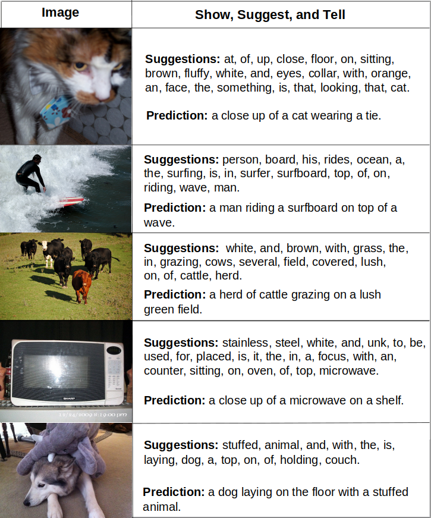

### Diffusion Is Your Friend in Show, Suggest, and Tell

Implementation code for "[Diffusion Is Your Friend in Show, Suggest and Tell](https://arxiv.org/pdf/2512.10038)" [ [BigData2026](https://www.computer.org/csdl/proceedings-article/bigdata/2025/11400981/2eDsZlyAFnG) ]
[ [Arxiv](https://arxiv.org/pdf/2512.10038) ]. <br>


### Requirements

```
conda create -n env_sst python=3.10
conda activate env_sst
# we tested on python=3.10, these are the main packages:
python3.10 -m pip install torch torchvision h5py numpy
```


### Training

In this guide we cover all the training steps reported in the paper and
provide the commands to reproduce our work.


#### Data preparation

MS-COCO 2014 images can be downloaded [here](https://cocodataset.org/#download), 
the respective captions are uploaded in our online [drive](https://drive.google.com/drive/folders/1bBMH4-Fw1LcQZmSzkMCqpEl0piIP88Y3?usp=sharing)
and the backbone can be found [here](https://github.com/microsoft/Swin-Transformer). All files, in particular
the `dataset_coco.json` file. The backbone is suggested to be moved in `github_ignore_materal/raw_data/` since commands provided
in the following steps assume these files are placed in that directory.

Give permission to download stanford model during evaluation (will be automatically handled later, but requires permission).
```
chmod a+x eval/get_stanford_models.sh
```


The following commands will generate the MS-COCO image features in `features.hdf5`.
```
cd show_suggest_tell
python3.10 data_generator.py \
    --save_model_path ./github_ignore_material/raw_data/swin_large_patch4_window12_384_22k.pth \
    --output_path ./github_ignore_material/raw_data/features.hdf5 \
    --images_path ./github_ignore_material/raw_data/MS_COCO_2014/ \
    --dtype fp16 \
    --captions_path ./github_ignore_material/raw_data/ &> log_data_gen.txt &
```
Note that it will take 50 GB of space.

#### Train Step 1) Suggestion Module Training

```
python3.10 train_suggestion_module.py \

    --N_enc 3 --N_dec 3  \
    --selected_n_gram 1 \
    --model_dim 128 --seed 775533 --optim_type radam --sched_type custom_warmup_anneal  \
    --warmup 500 --lr 2e-4 --anneal_coeff 0.95 --anneal_every_epoch 2 --enc_drop 0.1 \
    --dec_drop 0.1 --enc_input_drop 0.1 --dec_input_drop 0.1 --drop_other 0.1  \
    --batch_size 24 --num_accum 2 --num_gpus 1 --ddp_sync_port 11330 --eval_beam_sizes [3]  \
    --save_path ./github_ignore_material/saves_suggestion_module/ \
    --save_every_minutes 20 --how_many_checkpoints 1  \
    --features_path  ./github_ignore_material/raw_data/features.hdf5 \
    --print_every_iter 50 --eval_every_iter 6000 \
    --num_epochs 15 &> log_sugg_training.txt &
```
Note that recall and precision do not change much from three epochs to 15 but the 
impact on the prediction module's performance is significant.

#### Train Step 2) Show, Suggest, and Tell (SST) Training

Now that the prediction module is ready, we can proceed to train the prediction module.
Replace `<suggestion_module_checkpoint>` with the actual checkpoint of the previous step:

```
python3.10 train_captioning_model.py \

        --N_enc 3 --N_dec 3  \
        --selected_n_gram 1 \
        --model_dim 512 --seed 775533 --optim_type radam --sched_type custom_warmup_anneal  \
        --warmup 10000 --lr 2e-4 --anneal_coeff 0.8 --anneal_every_epoch 2 --enc_drop 0.3 \
        --dec_drop 0.3 --enc_input_drop 0.3 --dec_input_drop 0.3 --drop_other 0.3  \
        --batch_size 24 --num_accum 2 --num_gpus 1 --ddp_sync_port 11215 --eval_beam_sizes [3]  \
        --save_path ./github_ignore_material/saves_prediction_model/ \
        --sugg_module_save_path ./github_ignore_material/saves_suggestion_module/<suggestion_module_checkpoint> \
        --save_every_minutes 25 --how_many_checkpoints 3  \
        --is_end_to_end False --features_path ./github_ignore_material/raw_data/features.hdf5 \
        --partial_load False \
        --print_every_iter 1000 --eval_every_iter 2000 \
        --reinforce False --num_epochs 20 &> log_sst_train.txt &
```

### Evaluation

Evaluating the suggestion module, located in `<suggestion_module_checkpoint>`
```
python3.10 test_suggestion_module.py \
        --N_enc 3 --N_dec 3 --selected_n_gram 1 \
        --model_dim 128 --ddp_sync_port 11330 \
        --save_path ./github_ignore_material/saves_suggestion_module/<suggestion_module_checkpoint> \
        --features_path  ./github_ignore_material/raw_data/features.hdf5
```

Evaluating the SST in `<caption_model_checkpoint>` generated from the second training step.
```
python3.10 test_captioning.py \
        --N_enc 3 --N_dec 3 --selected_n_gram 1 \
        --model_dim 512 --ddp_sync_port 11330 \
        --save_sst_path ./github_ignore_material/saves_prediction_model/<caption_model_checkpoint> \
        --save_sugg_path ./github_ignore_material/saves_suggestion_module/<suggestion_module_checkpoint> \
        --features_path  ./github_ignore_material/raw_data/features.hdf5
```

Weights mentioned in the paper can be found [here](update_when_ready).


### Examples

<p align="center">
  
</p>


### Citation

If you find this repository useful, please consider citing (no obligation):
```
@InProceedings{diffusion2024hu,
author = { Hu, Jia Cheng and Cavicchioli, Roberto and Capotondi, Alessandro },
booktitle = { 2025 IEEE International Conference on Big Data (BigData) },
title = {{ Diffusion is Your Friend in Show, Suggest and Tell }},
year = {2025},
volume = {},
ISSN = {},
pages = {5142-5151},
abstract = {},
keywords = {Uniform resource locators;Noise reduction;Refining;Reinforcement learning;Predictive models;Linguistics;Diffusion models;Proposals;Feeds;Standards},
doi = {10.1109/BigData66926.2025.11400981},
url = {https://doi.ieeecomputersociety.org/10.1109/BigData66926.2025.11400981},
publisher = {IEEE Computer Society},
address = {Los Alamitos, CA, USA},
month =Dec}
```


